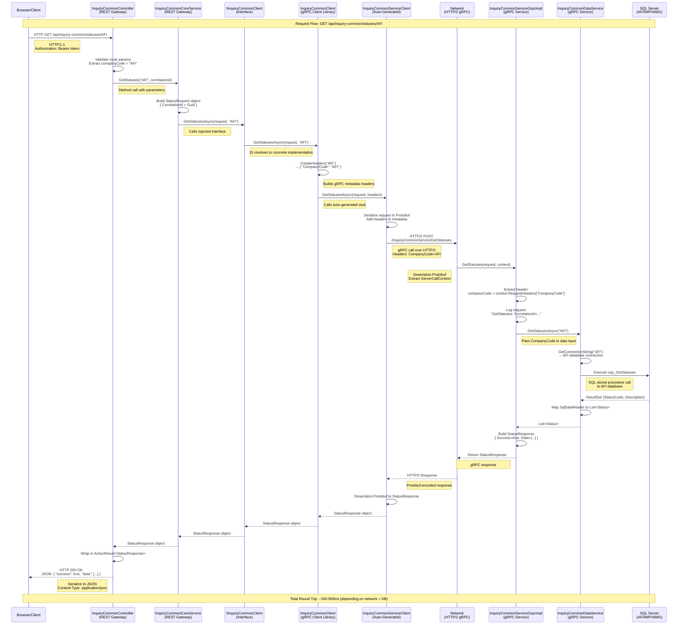
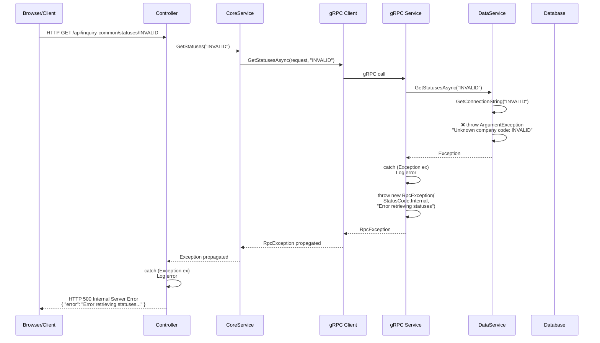
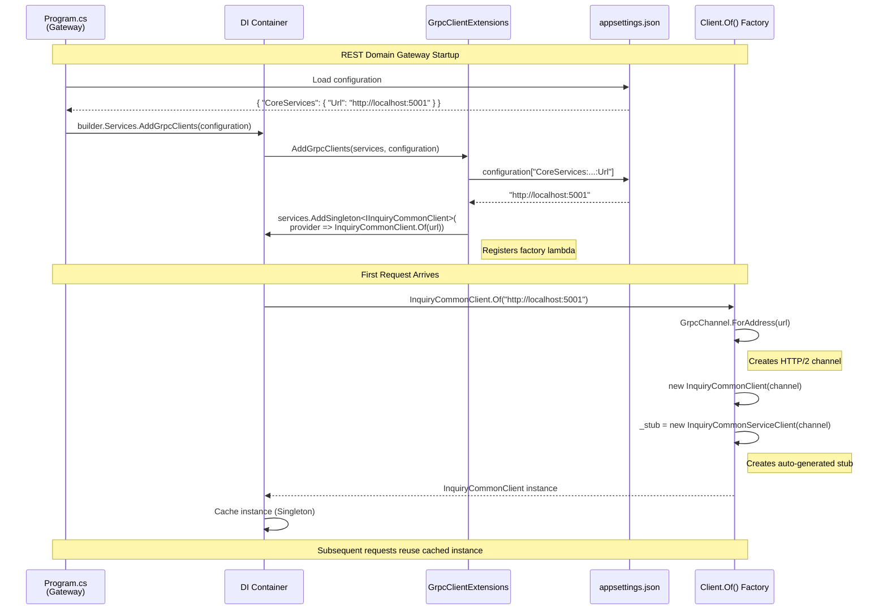
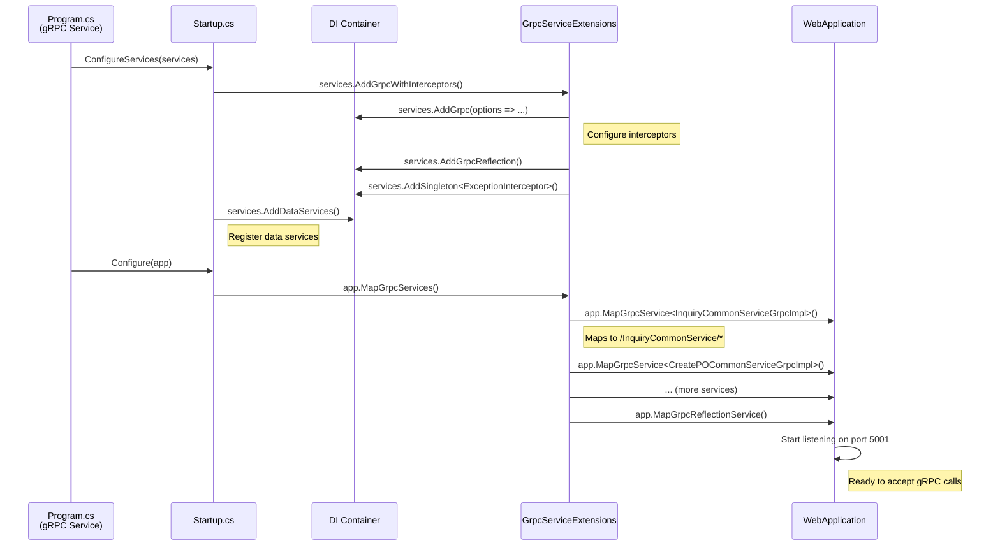

# gRPC Client Call Flow - Sequence Diagram

## Sequence Diagram: GetStatuses Request

```mermaid
sequenceDiagram
    participant Browser as Browser/Client
    participant Controller as InquiryCommonController<br/>(REST Gateway)
    participant CoreService as InquiryCommonCoreService<br/>(REST Gateway)
    participant ClientInterface as IInquiryCommonClient<br/>(Interface)
    participant Client as InquiryCommonClient<br/>(gRPC Client Library)
    participant Stub as InquiryCommonServiceClient<br/>(Auto-Generated)
    participant Network as Network<br/>(HTTP/2 gRPC)
    participant ServiceImpl as InquiryCommonServiceGrpcImpl<br/>(gRPC Service)
    participant DataService as InquiryCommonDataService<br/>(gRPC Service)
    participant Database as SQL Server<br/>(AFI/IMP/AIMG)

    Note over Browser,Database: Request Flow: GET /api/inquiry-common/statuses/AFI

    Browser->>Controller: HTTP GET /api/inquiry-common/statuses/AFI
    Note right of Browser: HTTP/1.1<br/>Authorization: Bearer token

    Controller->>Controller: Validate route params<br/>Extract companyCode = "AFI"
    
    Controller->>CoreService: GetStatuses("AFI", correlationId)
    Note right of Controller: Method call with parameters
    
    CoreService->>CoreService: Build StatusRequest object<br/>{ CorrelationId = Guid }
    
    CoreService->>ClientInterface: GetStatusesAsync(request, "AFI")
    Note right of CoreService: Calls injected interface
    
    ClientInterface->>Client: GetStatusesAsync(request, "AFI")
    Note right of ClientInterface: DI resolves to concrete implementation
    
    Client->>Client: CreateHeaders("AFI")<br/>→ { "CompanyCode": "AFI" }
    Note right of Client: Builds gRPC metadata headers
    
    Client->>Stub: GetStatusesAsync(request, headers)
    Note right of Client: Calls auto-generated stub
    
    Stub->>Stub: Serialize request to Protobuf<br/>Add headers to metadata
    
    Stub->>Network: HTTP/2 POST<br/>/InquiryCommonService/GetStatuses
    Note right of Stub: gRPC call over HTTP/2<br/>Headers: CompanyCode=AFI
    
    Network->>ServiceImpl: GetStatuses(request, context)
    Note left of Network: Deserialize Protobuf<br/>Extract ServerCallContext
    
    ServiceImpl->>ServiceImpl: Extract header:<br/>companyCode = context.RequestHeaders["CompanyCode"]
    
    ServiceImpl->>ServiceImpl: Log request:<br/>"GetStatuses: CorrelationId=..."
    
    ServiceImpl->>DataService: GetStatusesAsync("AFI")
    Note right of ServiceImpl: Pass CompanyCode to data layer
    
    DataService->>DataService: GetConnectionString("AFI")<br/>→ AFI database connection
    
    DataService->>Database: Execute usp_GetStatuses
    Note right of DataService: SQL stored procedure call<br/>to AFI database
    
    Database-->>DataService: ResultSet (StatusCode, Description)
    
    DataService->>DataService: Map SqlDataReader to List<Status>
    
    DataService-->>ServiceImpl: List<Status>
    
    ServiceImpl->>ServiceImpl: Build StatusResponse<br/>{ Success=true, Data=[...] }
    
    ServiceImpl-->>Network: Return StatusResponse
    Note left of ServiceImpl: gRPC response
    
    Network-->>Stub: HTTP/2 Response
    Note left of Network: Protobuf-encoded response
    
    Stub->>Stub: Deserialize Protobuf to StatusResponse
    
    Stub-->>Client: StatusResponse object
    
    Client-->>ClientInterface: StatusResponse object
    
    ClientInterface-->>CoreService: StatusResponse object
    
    CoreService-->>Controller: StatusResponse object
    
    Controller->>Controller: Wrap in ActionResult<StatusResponse>
    
    Controller-->>Browser: HTTP 200 OK<br/>JSON: { "success": true, "data": [...] }
    Note left of Controller: Serialize to JSON<br/>Content-Type: application/json

    Note over Browser,Database: Total Round Trip: ~100-500ms (depending on network + DB)
```

## Error Flow: Exception Handling

```mermaid
sequenceDiagram
    participant Browser as Browser/Client
    participant Controller as Controller
    participant CoreService as CoreService
    participant Client as gRPC Client
    participant ServiceImpl as gRPC Service
    participant DataService as DataService
    participant Database as Database

    Browser->>Controller: HTTP GET /api/inquiry-common/statuses/INVALID
    Controller->>CoreService: GetStatuses("INVALID")
    CoreService->>Client: GetStatusesAsync(request, "INVALID")
    Client->>ServiceImpl: gRPC call
    ServiceImpl->>DataService: GetStatusesAsync("INVALID")
    DataService->>DataService: GetConnectionString("INVALID")
    
    DataService->>DataService: ❌ throw ArgumentException<br/>"Unknown company code: INVALID"
    
    DataService-->>ServiceImpl: Exception
    
    ServiceImpl->>ServiceImpl: catch (Exception ex)<br/>Log error
    
    ServiceImpl->>ServiceImpl: throw new RpcException(<br/>StatusCode.Internal,<br/>"Error retrieving statuses")
    
    ServiceImpl-->>Client: RpcException
    
    Client-->>CoreService: RpcException propagated
    
    CoreService-->>Controller: Exception propagated
    
    Controller->>Controller: catch (Exception ex)<br/>Log error
    
    Controller-->>Browser: HTTP 500 Internal Server Error<br/>{ "error": "Error retrieving statuses..." }
```

## Component Initialization: Startup Flow

```mermaid
sequenceDiagram
    participant Program as Program.cs<br/>(Gateway)
    participant DI as DI Container
    participant GrpcExt as GrpcClientExtensions
    participant Config as appsettings.json
    participant ClientFactory as Client.Of() Factory

    Note over Program,ClientFactory: REST Domain Gateway Startup

    Program->>Config: Load configuration
    Config-->>Program: { "CoreServices": { "Url": "http://localhost:5001" } }
    
    Program->>DI: builder.Services.AddGrpcClients(configuration)
    
    DI->>GrpcExt: AddGrpcClients(services, configuration)
    
    GrpcExt->>Config: configuration["CoreServices:...:Url"]
    Config-->>GrpcExt: "http://localhost:5001"
    
    GrpcExt->>DI: services.AddSingleton<IInquiryCommonClient>(<br/>provider => InquiryCommonClient.Of(url))
    Note right of GrpcExt: Registers factory lambda
    
    Note over Program,ClientFactory: First Request Arrives
    
    DI->>ClientFactory: InquiryCommonClient.Of("http://localhost:5001")
    
    ClientFactory->>ClientFactory: GrpcChannel.ForAddress(url)
    Note right of ClientFactory: Creates HTTP/2 channel
    
    ClientFactory->>ClientFactory: new InquiryCommonClient(channel)
    
    ClientFactory->>ClientFactory: _stub = new InquiryCommonServiceClient(channel)
    Note right of ClientFactory: Creates auto-generated stub
    
    ClientFactory-->>DI: InquiryCommonClient instance
    
    DI->>DI: Cache instance (Singleton)
    
    Note over Program,ClientFactory: Subsequent requests reuse cached instance
```

## gRPC Service Startup Flow

```mermaid
sequenceDiagram
    participant Program as Program.cs<br/>(gRPC Service)
    participant Startup as Startup.cs
    participant DI as DI Container
    participant GrpcExt as GrpcServiceExtensions
    participant App as WebApplication

    Program->>Startup: ConfigureServices(services)
    
    Startup->>GrpcExt: services.AddGrpcWithInterceptors()
    
    GrpcExt->>DI: services.AddGrpc(options => ...)
    Note right of GrpcExt: Configure interceptors
    
    GrpcExt->>DI: services.AddGrpcReflection()
    
    GrpcExt->>DI: services.AddSingleton<ExceptionInterceptor>()
    
    Startup->>DI: services.AddDataServices()
    Note right of Startup: Register data services
    
    Program->>Startup: Configure(app)
    
    Startup->>GrpcExt: app.MapGrpcServices()
    
    GrpcExt->>App: app.MapGrpcService<InquiryCommonServiceGrpcImpl>()
    Note right of GrpcExt: Maps to /InquiryCommonService/*
    
    GrpcExt->>App: app.MapGrpcService<CreatePOCommonServiceGrpcImpl>()
    GrpcExt->>App: ... (more services)
    
    GrpcExt->>App: app.MapGrpcReflectionService()
    
    App->>App: Start listening on port 5001
    Note right of App: Ready to accept gRPC calls
```

